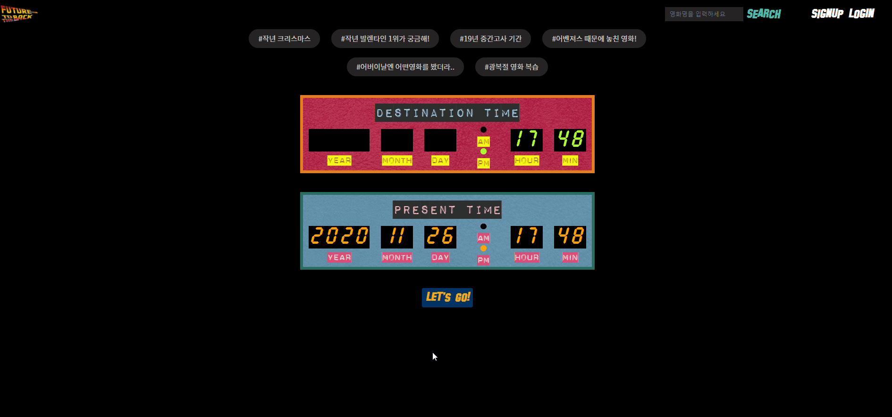
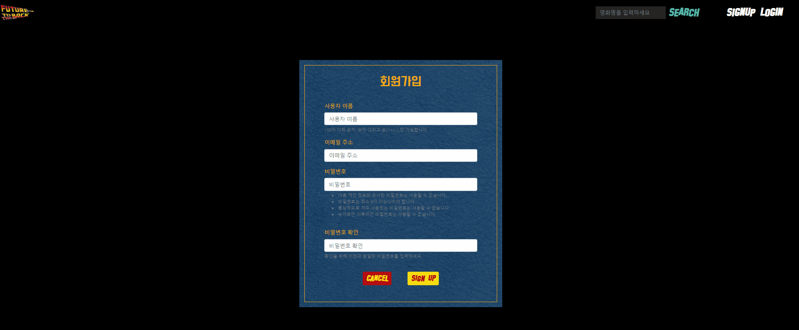
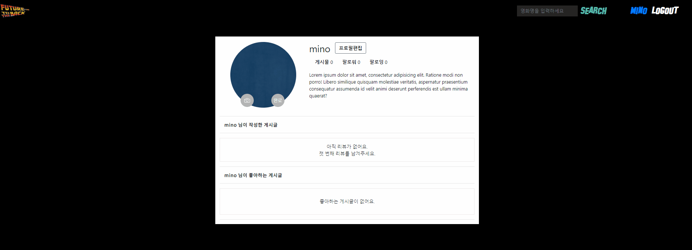
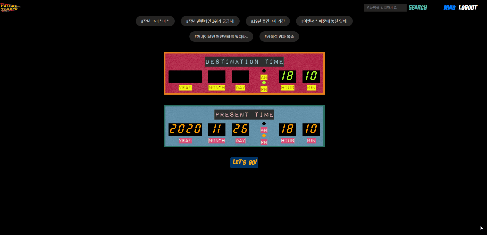
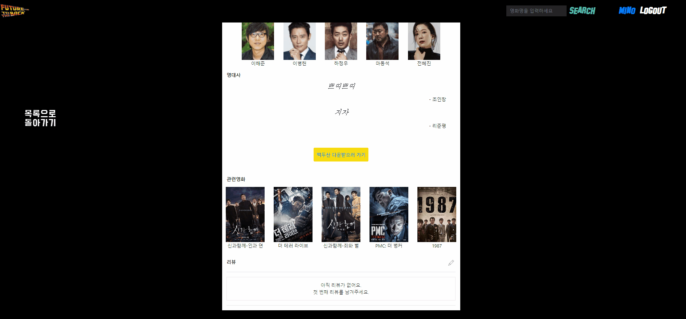
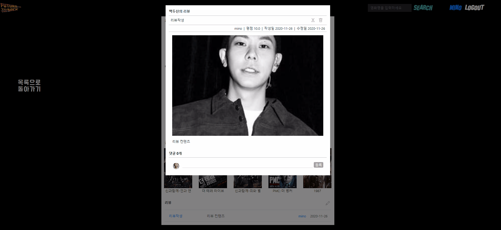
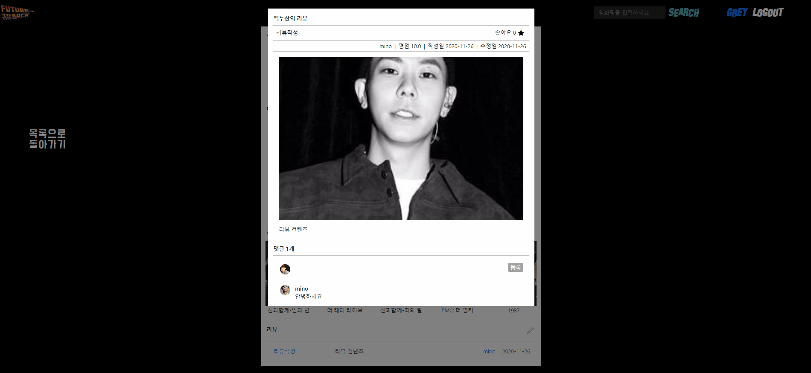
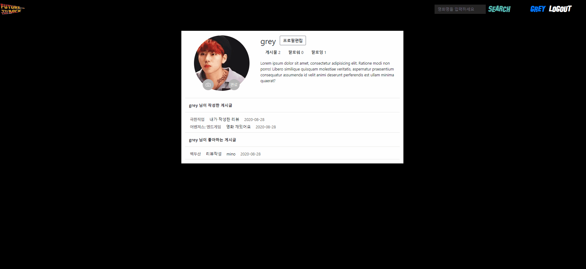

# 											🏎Future to the Back🏍


### 과거 내가 `궁금했던 날짜`의 박스오피스 순위와 영화 정보를 보여주며 추억을 회상할 수 있는 영화 정보 사이트

```
예) 작년 크리스마스에는 어떤 영화가 1위를 했었지? 아 맞다 그때 `어벤져스`가 유행이었지
```

해당 박스오피스 순위와 함께 당시 1위 영화에 감춰져 흥행하지는 못했지만 전문가와 네티즌의 평점이 가장 높았단 `숨은 명작 영화`를 추천해줌


------

### 1. install project

- 가상환경 생성 & 활성화

```bash
$python -m venv venv

#window
$source venv/Scripts/activate

#mac / linux
$source venv/bin/activate
```

- 라이브러리 설치(가상환경을 실행)

```bash
(venv)
$pip install -r requirements.txt
```

- 데이터베이스 생성 및 데이터 삽입

```bash
$python manage.py makemigrations
$python manage.py migrate

# 순서 주의
$python manage.py loaddata fixtures/movies.json
$python manage.py loaddata fixtures/movies_detail.json
```

- 서버 실행

```bash
$python manage.py runserver
```

---

### 2.페이지 설명

1. **원하는 시점의 박스오피스 순위 검색 기능**

   홈화면에서  `원하는 시점`의 날짜 값을 입력 혹은 위에 추천 시점 리스트를 클릭 후 Let's Go버튼을 클릭
   하면 해당 시점의 `박스오피스` 순위 보기

   


2. **회원가입 & 로그인 & alert 기능**

   회원가입시 자동으로 로그인 및 원래 위치로 redirect 

   


3. 회원 프로필 정보 수정기능

   프로필 페이지에서 회원의 사진 및 회원정보, 비밀번호를 변경 가능

   

4. **영화 검색 기능**

   영화 검색 시 영화의 상세 페이지로 이동

   


5. **영화 리뷰 작성 기능****

   로그인 유저의 한 해 리뷰작성 기능 제공

   


6. **댓글 작성 기능**

   AJAX 통신을 통해 화면 새로고침없이 댓글 생성 및 삭제 가능

   


7. **리뷰 글 좋아요 및 다른 유저 follow 기능**

   마음에 드는 계시글에 좋아요를 줄 수 있고 해당 글의 작성자를 클릭하면 작성자의 프로필 페이지로 이동 

   작성자의 정보 및 작성자 follow가능

   

   

8. 내가 작성한 계시글 및 내가 좋아요 한 글 목록 보기

   유저 프로필 페이지에서 유저가 작성한 글 혹은 타유저의 계시글에 좋아요를 클릭한 정보를 볼 수 있는 기능

   


---

### 3. 배포 주소 정보

AWS lightsail 을 통해서 배포한 주소 

```
http://52.78.135.247/
```


---

### 4. 활용한 라이브러리 

영화 박스오피스 순위 정보를 확보하기 위해서 영화진흥위원회의 API 데이터 활용

영화의 상세 정보 파악을 위해서 Selenium과 bs4 라이브러리를 활용한 네이버 영화 데이터 크롤링


---


### 5.향후 구현하고 싶은  추가적인 기능

	1. 영화의 트레일러 정보 삽입
 	2. 리뷰 작성글이 많아지는 상황을 대비한 페이지 네이션 기능
 	3. 댓글 좋아요 기능
 	4. 댓글에 대한 답글 기능
 	5. 데이터 베이스의 크기 확장(현재 100개의 영화 데이터 확보)


---

### 6. 느낀점

하나의 영화 정보 사이트를 제작하면서 사용자 경험 측면에서 웹을 개발하는게 생각보다 까다롭고 변수가 많다는 것을 깨달았다. 자바스크립트를 활용한 기능들이 많으며 해당 기능들에 대한 추가적인 공부의 필요성을 느꼈다. 